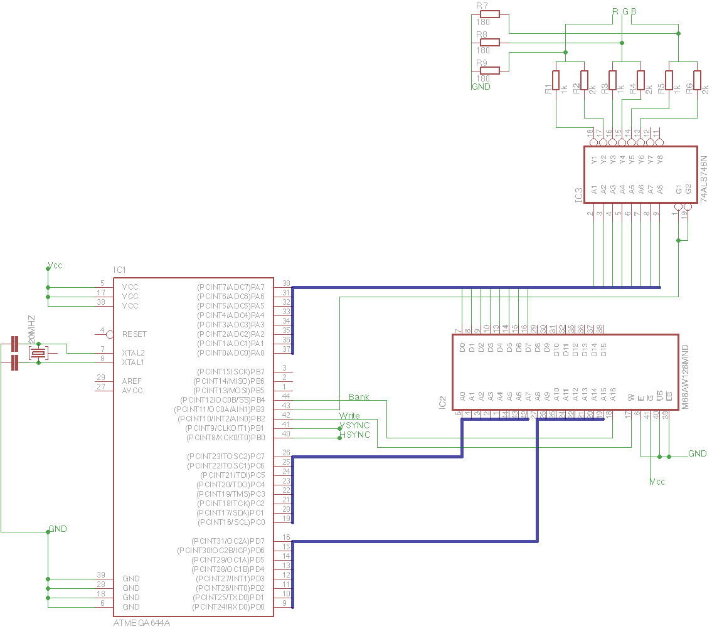

VAVR
===========================================
The goal of this project is to display a screen image using a single mcu (microcontroller unit).

The mcu chosen for this particular project is the ATMEGA644P-20PU, and that because of the following reasons:
    * 4 IO Ports
    * 20MHz clock capability

The following schematic is used for the process

